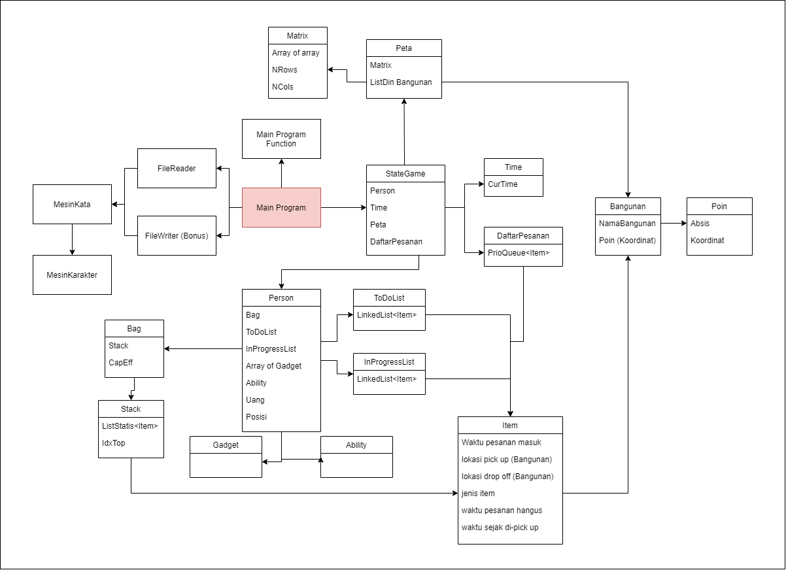

# Tubes Alstrukdat

## UML Diagram

## Build
### 1. Requirement
Make sure these dependencies are installed before building the program:
- CMake >= 3.6
- Make
- GNU C Compiler (for Windows, make sure to use MinGW GCC instead)
### 2. Step
- Windows: Run `build.bat` script.
- In Linux / bash: Run `build.sh` script.

Binary will be located in `build/bin` after running the script.
